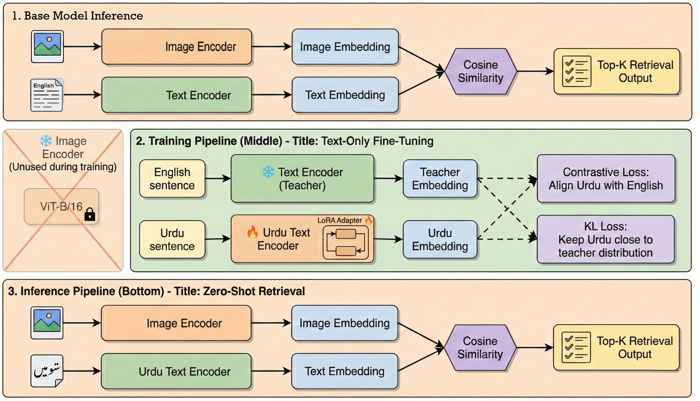
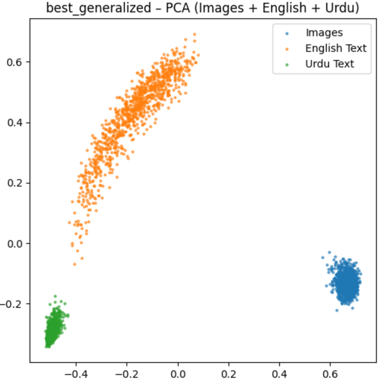
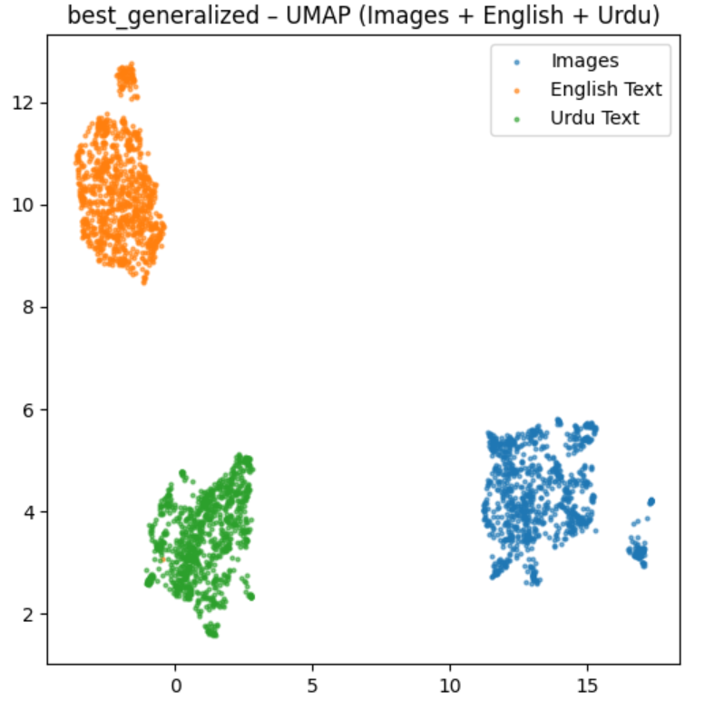
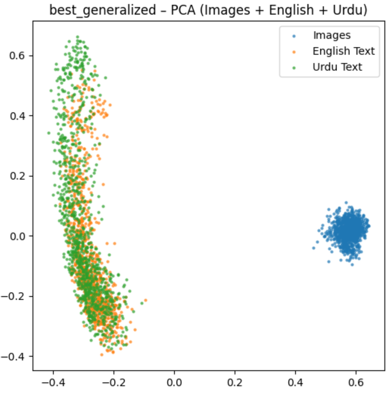
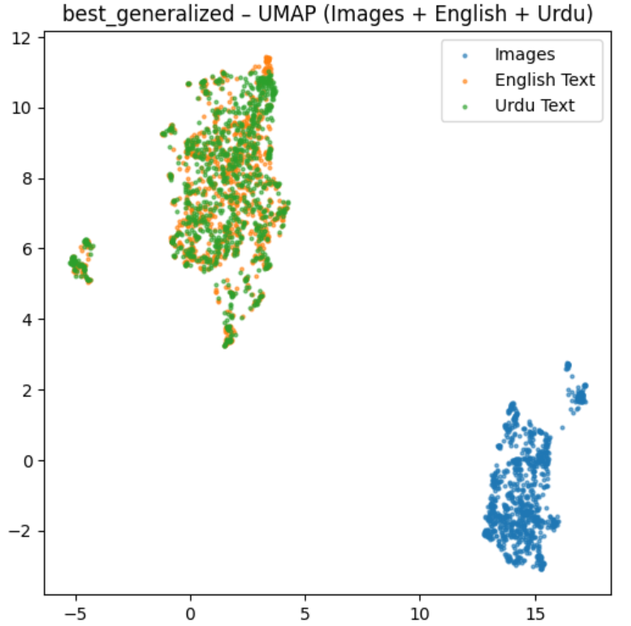

# **CIKLIFT: Contrastive & Integrated KL–Driven Interlingual Fine-Tuning**

CIKLIFT is a lightweight and efficient method designed to adapt **CLIP/SigLIP-style Vision-Language Models** to **Urdu** through a simple and scalable **text-only fine-tuning pipeline**. The vision encoder remains frozen throughout the process, allowing the entire framework to run efficiently even on a single consumer GPU.

This repository contains notebooks, model weights, and evaluation resources used to reproduce the experiments and results presented in the thesis.

---

## 🌟 **Key Highlights**

- **Text-only adaptation** of the model's text encoder  
- **Preserves English capabilities** while enhancing Urdu understanding  
- **Parameter-efficient** using LoRA  
- **Two-stage adaptation** with large-scale parallel Urdu–English text and Urdu captions  
- **Lightweight training requirements** (12GB GPU compatible)  
- **High-quality notebooks** for training, testing, and visualization  
- **No need to retrain or modify the vision encoder**

---

## 📂 **Repository Structure**
```
CIKLIFT/
│
├── all_notebooks/          # All training, testing, visualization, PCA/UMAP notebooks
├── all_weights/            # All checkpoints, LoRA adapters, best-performing model weights
├── requirements.txt
└── README.md
```

---

## 📥 **Dataset Access**

The datasets used in this project can be downloaded from the following link:

**🔗 Google Drive (Dataset Link):**  
_Add your link here_

You may place the datasets anywhere and adjust the notebook paths accordingly.

---

## 🏛 **High-Level Architecture**



This diagram explains the two-stage text-only adaptation process and how the model aligns Urdu embeddings with the original English-visual embedding space.

---

## 📊 **Embedding Space Visualizations**

### Before Adaptation: SigLIP2 Pretrained

#### PCA Projection (SigLIP2 Pretrained)


#### UMAP Projection (SigLIP2 Pretrained)


The visualizations above show clear separation between English and Urdu text embeddings in the pretrained SigLIP2 model, indicating poor cross-lingual alignment.

---

### After Adaptation: CIKLIFT (Finetuned)

#### PCA Projection (CIKLIFT)


#### UMAP Projection (CIKLIFT)


After fine-tuning with CIKLIFT, the Urdu and English text embeddings are well-aligned and overlap substantially, demonstrating successful cross-lingual adaptation while maintaining coherent relationships with the visual modality.

---

---

## 📈 **Performance Summary**

| Model              | Urdu Recall@1 | English Recall@1 | Notes                                          |
| ------------------ | ------------- | ---------------- | ---------------------------------------------- |
| CLIP ViT-B/16      | 0.5%          | 82.4%            | Fails on Urdu                                  |
| SigLIP2            | 10.2%         | 92.1%            | Best zero-shot baseline                        |
| Full Fine-Tuning   | 33.2%         | 49.1%            | English collapses                              |
| LoRA (standard)    | 22.3%         | 46.3%            | Balanced but low Urdu                          |
| **CIKLIFT (Ours)** | **57.0%**     | **74.5%**        | Best Urdu performance while preserving English |

---

## 🧪 **Notebooks Included**

The `all_notebooks/` folder contains fully documented notebooks for:

* text-only alignment
* Retrieval testing
* PCA and UMAP visualization
* Model comparison tools

These can be executed directly in Colab, Kaggle, or a local Python 3.10 environment.

---

## 💾 **Model Weights**

All trained adapters and final weights are stored in the `all_weights/` folder, including:

* LoRA adapters
* Final adapted text encoder
* Best checkpoint for inference

Organized by experiment and training stage.

---

## 📦 **Requirements**

This project uses:
```
Python 3.10
```

Install dependencies:
```bash
pip install -r requirements.txt
```

---

## 🤝 **Contributing**

You are welcome to open issues or contribute improvements.

---

---

**Made with ❤️ for advancing Urdu NLP research**
